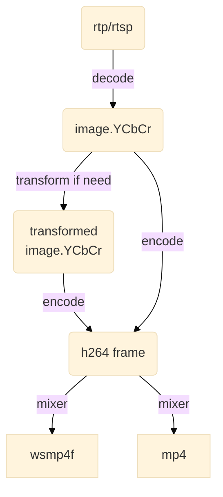

```mermaid
%%{init:{'theme':'base'}}%%
flowchart TB
    livestream("rtp/rtsp")
    pic("image.YCbCr")
    transformed_pic("transformed\nimage.YCbCr")
    frame("h264 frame")
    
    livestream
    -->|"decode"| pic
    -->|"transform if need"| transformed_pic
    -->|"encode"| frame
    
    pic
    -->|"encode"| frame
    
    frame
    -->|"mixer"| wsmp4f & mp4

```